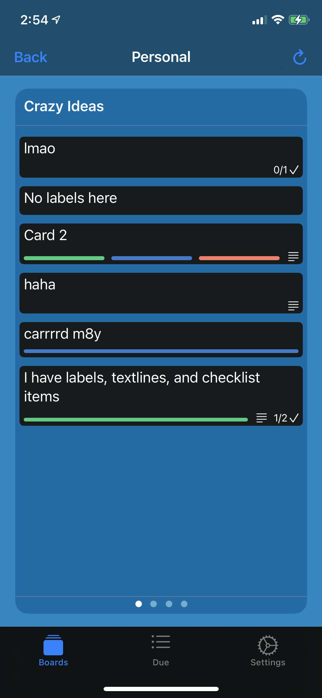
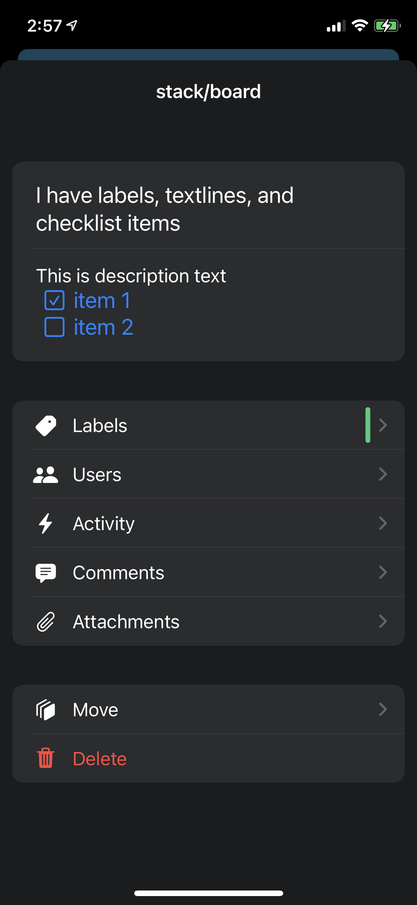

# iOS-Deck
Nextcloud Deck app for iOS

Built using as much swiftUI as possible

Utilizes [Nextcloud/iOS-Communication-Library](https://github.com/nextcloud/ios-communication-library) (or a fork of it)

#### Early Screenshots (so wip obviously)
Boards                     |  Populated Stack              | Card View          |
:-------------------------:|:-------------------------:|:-------------------------:
 |  |  
